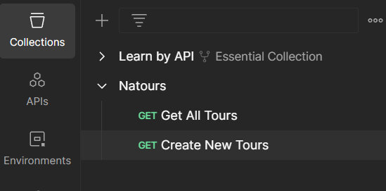

# Postman

Development tool for API

## Collections

* Project to hold custom API requests

<figure><figcaption></figcaption></figure>

<figure><figcaption></figcaption></figure>

## Environments

* Introduce environment variables
  * Convenient for JWT
  * Replace REST API request with \{{\}}. E.g. \{{URL\}}/api/tours

<figure><figcaption></figcaption></figure>

* Under tests, set an environment variable to automatically store JWT

```
pm.environment.set("jwt", pm.response.json().token)
```

* Under authorisation tab (not headers), choose bearers and pass \{{jwt\}}

